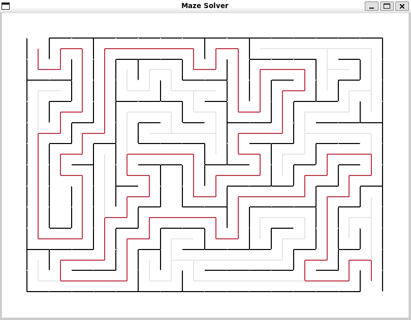

# Maze Generator and Solver

## Overwiew

Maze generator and solver, draws a randomized maze using **tkinter (GUI)** and then systematically solves it using **depth first search (DFS)**.

## Requirements

- Python 3.x
- Tkinter(GUI)

## Features

- Creates randomized maze
- Solves maze

## Usage

**1. Navigate to the project directory:**
```bash
cd Maze_Generator_and_Solver/
```
**2. Run main.py file:**
```bash
python main.py
```
**3. Output:**


